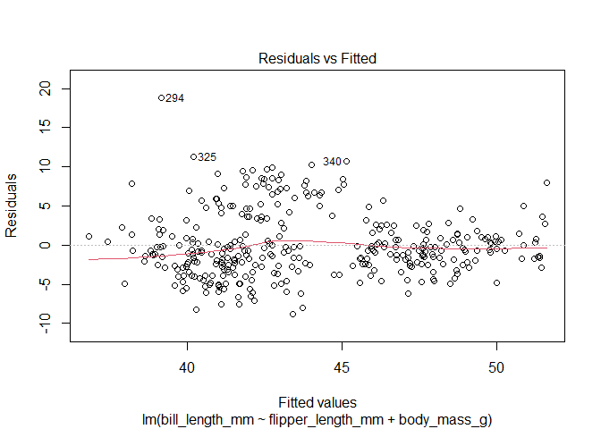

Demo for ISOM
================
15 May, 2025

This manuscript uses the Workflow for Open Reproducible Code in Science
(Van Lissa et al. 2021) to ensure reproducibility and transparency. All
code <!--and data--> are available at <isom>.

This is an example of a non-essential citation (@ Van Lissa et al.
2021). If you change the rendering function to `worcs::cite_essential`,
it will be removed.

<!--The function below inserts a notification if the manuscript is knit using synthetic data. Make sure to insert it after load_data().-->

## GitHub Documents

This is an R Markdown format used for publishing markdown documents to
GitHub. When you click the **Knit** button all R code chunks are run and
a markdown file (.md) suitable for publishing to GitHub is generated.

## Including Code

You can include R code in the document as follows:

``` r
res <- lm(bill_length_mm ~  flipper_length_mm + body_mass_g, data = df)
```

## Including Plots

You can also embed plots, for example:

<!-- -->

Note that the `echo = FALSE` parameter was added to the code chunk to
prevent printing of the R code that generated the plot.

``` r
tab <- data.frame(
  a = 1:5,
  b = 6:10,
  c = letters[1:5]
)
write.csv(tab, "tab.csv")
cat(worcs:::cs_fun("tab.csv"))
```

    ## c83bed0414877b2359697fbf2af5c89d

``` r
tab <- read.csv("tab.csv")
knitr::kable(tab)
```

|   X |   a |   b | c   |
|----:|----:|----:|:----|
|   1 |   1 |   6 | a   |
|   2 |   2 |   7 | b   |
|   3 |   3 |   8 | c   |
|   4 |   4 |   9 | d   |
|   5 |   5 |  10 | e   |

<div id="refs" class="references csl-bib-body hanging-indent"
entry-spacing="0">

<div id="ref-vanlissaWORCSWorkflowOpen2021" class="csl-entry">

Van Lissa, Caspar J., Andreas M. Brandmaier, Loek Brinkman, Anna-Lena
Lamprecht, Aaron Peikert, Marijn E. Struiksma, and Barbara M. I. Vreede.
2021. “WORCS: A Workflow for Open Reproducible Code in Science.” *Data
Science* 4 (1): 29–49. <https://doi.org/10.3233/DS-210031>.

</div>

</div>
